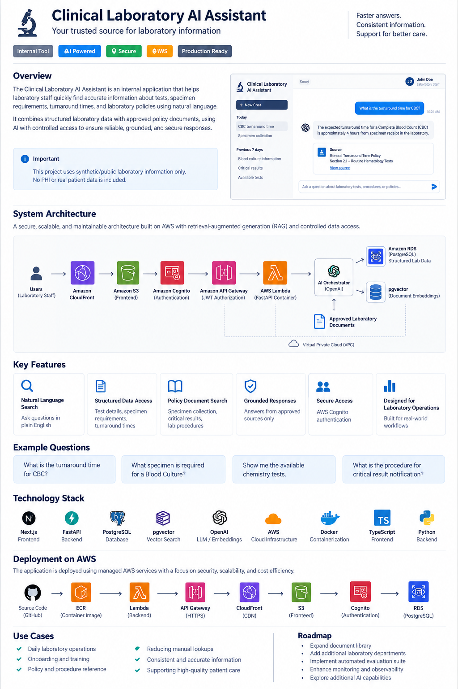

🧪 Clinical Laboratory AI AssistantSecure, grounded AI access to laboratory tests, specimen guidance, turnaround times, and approved laboratory policies.

Production-oriented internal AI assistant built with RAG, controlled SQL retrieval, native LLM tool calling, and AWS serverless infrastructure.

Overview
The Clinical Laboratory AI Assistant is designed as an internal tool for quickly retrieving approved laboratory information through natural-language questions.
Instead of searching separate databases and policy documents, users can ask questions such as:

What is the turnaround time for CBC?
What specimen is required for a blood culture?
What is the specimen collection guidance?
The system combines structured PostgreSQL data with RAG-based policy retrieval while restricting the LLM to approved tools and grounded sources.

Data & Safety: This repository uses synthetic/public laboratory information only. No PHI or real patient records are included.

System Architecture

Request FlowUser
  │
  ▼
CloudFront + Private S3
  │
  ▼
Next.js Frontend
  │
  ▼
Amazon Cognito
  │ JWT
  ▼
API Gateway
  │
  ▼
AWS Lambda / FastAPI
  │
  ▼
AI Orchestrator
  ├──────────────► Controlled SQL Tool ──► PostgreSQL
  │
  ├──────────────► RAG Retrieval ───────► pgvector
  │
  └──────────────► Lab Test Listing
                         │
                         ▼
                  OpenAI Responses API
                         │
                         ▼
                Grounded Answer + Sources
Key Capabilities
Capability
Implementation
Natural-language laboratory search
OpenAI native function calling
Structured data retrieval
Controlled parameterized PostgreSQL queries
Policy/document search
RAG with embeddings + pgvector
Grounded responses
Answers generated only from retrieved evidence
Hallucination controls
Similarity filtering + deterministic no-data response
Authentication
Amazon Cognito
API authorization
API Gateway JWT authorizer
Private database
Amazon RDS inside private VPC subnets
Containerized backend
Docker → ECR → AWS Lambda
Observability
CloudWatch + application loggingAI & Retrieval Design
The LLM is used as an orchestrator, not as the source of truth.
It can invoke only approved tools:
search_lab_test()
search_knowledge_base()
list_lab_tests()
Structured Questions
Example:
"What is the turnaround time for CBC?"
Flow:
Question
   ↓
Agent
   ↓
Controlled SQL Tool
   ↓
PostgreSQL
   ↓
Verified Lab Record
   ↓
Grounded Response
The model is not allowed to generate unrestricted SQL.
RAG Questions
Example:
"What is the specimen collection guidance?"
Flow:
Question
   ↓
Embedding
   ↓
pgvector similarity search
   ↓
Relevant policy chunks
   ↓
Retrieval validation
   ↓
LLM
   ↓
Answer + document source
Knowledge sources include:
critical_results.md
specimen_collection.md
turnaround_policy.md
Retrieval Quality Controls
Vector search always returns the nearest result, even when the result may not be relevant enough.
To prevent weak matches from reaching the LLM, the retrieval layer applies:
Absolute similarity floor : 0.35
Relative similarity ratio : 0.75
If sufficient evidence is unavailable, the application returns:
The requested information is not available in the approved laboratory data sources.
This prevents the assistant from filling missing information using general model knowledge.
Production Safety Controls
The application uses multiple layers of protection:
Controlled tool access
        +
Parameterized SQL
        +
RAG similarity validation
        +
Grounded generation
        +
Out-of-scope handling
        +
Request validation
        +
API error handling
The assistant is intentionally restricted from providing:
Patient-specific diagnosis
Treatment recommendations
Interpretation of patient laboratory results
Unsupported medical conclusions
Answers from unapproved sources
Technology StackApplication
Layer
Technology
Frontend
Next.js, React, TypeScript, Tailwind
Backend
Python, FastAPI, Pydantic
AI
OpenAI Responses API
Tool orchestration
Native function calling
Embeddings
text-embedding-3-small
Database
PostgreSQL
Vector search
pgvector
DB driver
psycopg 3
Runtime
DockerAWS Infrastructure
AWS Service
Purpose
CloudFront
HTTPS frontend delivery
S3
Private static frontend hosting
Cognito
User authentication
API Gateway
Public API + JWT authorization
Lambda
Containerized FastAPI runtime
ECR
Docker image registry
RDS PostgreSQL
Structured + vector data
VPC
Private networking
NAT Gateway
Controlled outbound access to OpenAI
CloudWatch
Runtime logs and diagnosticsDatabase DesignStructured Laboratory Datadepartments
lab_tests
test_aliases
Example records:

Test Code
Test Name
CBC
Complete Blood Count
CMP
Comprehensive Metabolic Panel
BCULT
Blood CultureRAG Storagedocument_chunks
indexed_documents
The same PostgreSQL environment therefore supports both:
Relational laboratory data
            +
Vector-based document retrieval
Production DeploymentBackendSource Code
   ↓
Docker Build
   ↓
Amazon ECR
   ↓
AWS Lambda
   ↓
API Gateway
FrontendNext.js Static Export
   ↓
Private Amazon S3
   ↓
CloudFront + OAC
   ↓
HTTPS
DatabasePrivate RDS PostgreSQL
   ↓
pgvector Extension
   ↓
Structured Data + Document Embeddings
The production application does not create tables or seed demo data during startup.
Database bootstrap and document indexing are performed separately from application runtime.
Evaluation
The system was tested across:
Structured laboratory lookups
Policy retrieval
Tool selection
RAG grounding
Unsupported questions
Out-of-scope requests
Hallucination scenarios
Prompt-injection attempts
Current focused regression evaluation:
10 / 10 passing
The evaluation suite can be expanded as additional laboratory content and workflows are introduced.
Deployment Challenges ResolvedLambda Runtime Compatibility
The Docker container initially worked locally but failed in Lambda because the image architecture and Lambda runtime architecture did not match.
Docker image → AMD64
Lambda       → ARM64
The deployment image was rebuilt for linux/amd64 and Lambda was aligned to x86_64.
Private VPC Connectivity
Lambda initially lacked permission to create the network interfaces required for VPC connectivity.
The execution role was updated with the appropriate Lambda VPC permissions.
pgvector Initialization
RDS initially rejected the vector schema because the extension had not yet been enabled.
CREATE EXTENSION IF NOT EXISTS vector;
was executed before creating the vector-backed tables.
CloudFront Origin Configuration
CloudFront initially returned AccessDenied because an incorrect /project origin path was configured while the exported frontend files were stored at the S3 bucket root.
The origin path was corrected and the CloudFront cache was invalidated.
Repository Structureclinical-lab-ai-assistant/
│
├── backend/
│   ├── app/
│   ├── scripts/
│   ├── Dockerfile
│   └── Dockerfile.lambda
│
├── database/
│   └── bootstrap/
│
├── frontend/
│   ├── app/
│   └── src/components/
│
├── knowledge-base/
│
├── docs/
│   └── clinical-lab-ai-architecture.png
│
├── docker-compose.yml
├── .gitignore
└── README.md
Scope
This project demonstrates a production-oriented architecture for an internal clinical laboratory knowledge assistant.
It focuses on:
secure retrieval · grounded AI · controlled data access · production deployment · healthcare AI safety
It does not contain real patient information and is not intended to replace clinical judgment.
Clinical Laboratory AI Assistant
Python · FastAPI · PostgreSQL · pgvector · OpenAI · Docker · AWS · Next.js